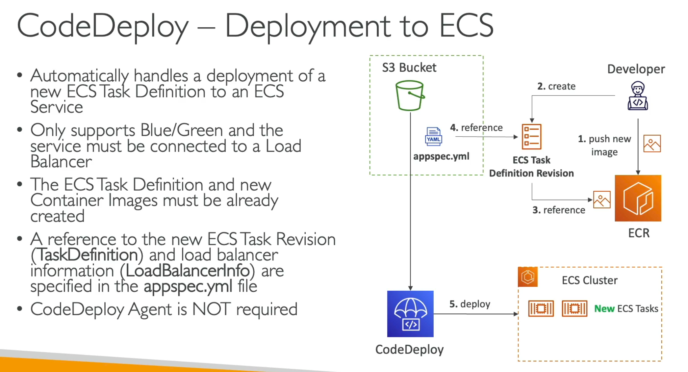

# README

# AWS Deployment Proof of Concept

This project aims to test various AWS services through real-world proof-of-concept implementations.

## 🔵🟢 AWS Blue/Green Deployment with CodeDeploy

In this proof of concept, we implement a complete deployment pipeline using AWS CodeDeploy and the **Blue/Green Deployment** strategy. This approach keeps two sets of EC2 instances: one actively serving traffic and the other idle. During deployment, the new version of the application is loaded onto the idle group, and once validated, the load balancer redirects traffic to them—resulting in near-zero downtime.

### ✅ Key Concepts Learned

This project serves as a hands-on guide to understanding:

- **Blue/Green Deployment** – Deployment strategy with zero downtime.
- **ECS (Elastic Container Service)** – Cluster-based container orchestration.
- **`appspec.yml`** – Script that controls deployment lifecycle hooks.
- **CodeDeploy Deployment Flow** – How AWS manages complete deployments through integrated services.
- **S3** – For storing build artifacts and deployment files.
- **ECR (Elastic Container Registry)** – Docker image repository.
- **CodeDeploy** – AWS service for managing deployments to ECS and EC2.
- **CI/CD** – Automated image building and deployment to ECR and ECS via CodeDeploy.

### 🛠 Development Flow with Terraform

We use **only Terraform** to replicate the following deployment architecture:




appspec.yml:


The main infrastructure is defined in [`main.tf`](https://www.notion.so/main.tf), which includes:

- ECS task definitions
- Security groups
- IAM roles and permissions
- Load balancer and listener rules

Example Terraform block:

```
resource "aws_ecs_task_definition" "frontend_task" {
  family                   = "frontend-task"
  container_definitions    = jsonencode([{
    name      = "app"
    image     = "${var.aws_account_id}.dkr.ecr.${var.aws_account_region}.amazonaws.com/app-ecr-repository:latest"
    essential = true
    portMappings = [
      {
        containerPort = 80
        hostPort      = 80,
        protocol      = "tcp"
      }
    ]
  }])
  requires_compatibilities = ["EC2"]
  memory                   = 1800
  cpu                      = 512
  execution_role_arn       = aws_iam_role.app_task_role.arn
  network_mode = "host"
}
```

Note: `network_mode = "host"` allows containers to share the host's network stack.

### 📊 Results

**Successful CodeDeploy Deployments:**


**Active Instances:**


**CI/CD Pipeline:**


**Load Balancer Functionality:**


## 🌿 AWS Elastic Beanstalk

This second proof of concept explores deploying a simple application using **AWS Elastic Beanstalk**. All configuration files are located in the `awseb/` folder.

### 🚀 Deploy Steps

1. **Create Beanstalk environment:**

```powershell
pip install awsebcli
eb init  # Configura tu aplicación de Elastic Beanstalk con tu cuenta de AWS 

# PUEDE SER NECESARIO CREAR UN ROL IAM O AGREGAR LAS CREDENCIALES DEL SERVIDOR ROOT
#### es necesario crear commits ya que eb deploya y crea ambientes con
### lo que esta staged en los commits
eb create my-environment --enable-spot  # Crea un entorno Elastic Beanstalk
eb deploy  # Despliega la aplicación en ese entorno
```

Also manually review the AWS console to clean up:

- EC2 instances
- Load balancers
- RDS databases
- S3 buckets and CloudWatch logs
- Auto Scaling Groups
- Unused EBS volumes or snapshots

### ⚠️ Deployment and Git Sync

- Running `eb terminate` removes your AWS environment, **but does not affect your local Git repository**.
- If you **make changes without committing**, those changes won’t be included in future `eb create` deployments.

### ✅ To ensure consistency:

1. Always commit changes:
    
    ```
    git add .
    git commit -m "Update environment files"
    git push origin main
    ```
    
- Before running `eb create`, ensure you're at the desired commit.
- Check for untracked changes with:
    
    ```
    git status
    ```
    

This ensures your new Beanstalk environment is created with the correct configuration and avoids sync issues.